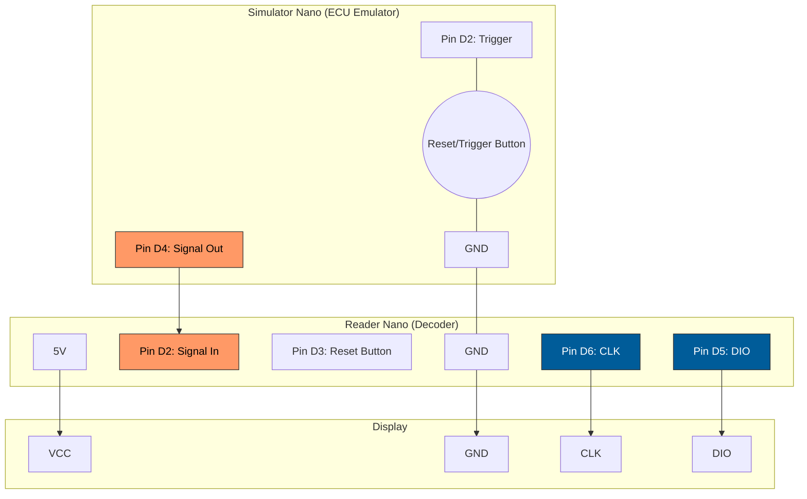

# BMW R1100R Motronic 2.2 Diagnostic Code Reader

An Arduino-based digital pulse code reader designed specifically for the 1996 BMW R1100R (and other Motronic 2.2 Oilheads). This tool automates the process of counting analog voltage dips from the bike's 3-pin diagnostic connector and translates them into a clear, readable 4-digit numeric fault code.

## Features
* **Automatic Pulse Decoding:** Eliminates human error involved in counting manual LED "blink codes."
* **On-Demand Trigger:** Built-in push button handles the required 5-second grounding trick automatically.
* **On-the-Fly Reset:** Local reset button clears the screen and queues the device for the next diagnostic cycle.
* **Streamlined Design:** Pure engine management troubleshooting—no unnecessary circuitry.

---

## Bill of Materials (BOM)
* **Microcontroller:** Arduino Nano 3.0 (ATmega328P, CH340 USB serial)
* **Display:** TM1637 4-Digit Display
* **Buttons:** 2x Momentary Push Buttons (Reset & Trigger)
* **Resistors:** 1x 10k Ohm, 1x 4.7k Ohm (for the 12V-to-5V voltage divider)

---

## Schematic & Wiring

> ⚠️ **CRUCIAL:** You must use the voltage divider resistors below to protect the Arduino's input pins from the bike's 12V–14V environment. Connecting Pin 1 directly to the Nano will destroy the chip.

```bash
[ R1100R Bike Plug ]                  [ Diagnostic Box Layout ]
   Pin 1 (Signal)     ──────┬──────────> Trigger Button (Leg A)
                            └─[10kΩ]───> Arduino Pin D2
                                  ├──┬─> [4.7kΩ] ──> Arduino GND
                                  └──
   Pin 3 (Ground)     ─────────────────> Trigger Button (Leg B) & Arduino GND
```

### Component Connections:



* **Reset Button:** Connected between Arduino **Pin D3** and **GND**.
* **TM1637 Display:** CLK ──> **D6** | DIO ──> **D5** | VCC ──> **5V** | GND ──> **GND**.

---

## Installation & Software Prerequisites

### 1. Arduino IDE
To compile and flash the firmware, download and install the official Arduino SDK for your architecture from:
👉 **https://www.arduino.cc/en/software/**

### 2. Dependencies
This project requires the **TM1637Display** library by Avishay Orpaz. Install it directly through the Arduino IDE:
1. Open the Arduino IDE.
2. Go to **Sketch** ──> **Include Library** ──> **Manage Libraries...** (or press `Ctrl + Shift + I`).
3. Search for `TM1637Display` and look for the version by **Avishay Orpaz**.
4. Click **Install**.

### 3. Linux USB Permissions
If you encounter permission issues when uploading to your CH340 board via `/dev/ttyUSB0`, grant serial write access to your user profile:
```bash
sudo usermod -a -G dialout $USER
```
---
## Debugging
### TTY

Both Reader and Simulator are printing the codes in a similar fashion, which can be read out if connected via data-cable:

```sh
====================================
BMW R1100R Motronic Simulator v1.1
====================================
[SYSTEM] Ready. Waiting for 5s trigger...

[TRIGGER] 5s hold detected. Starting sequence...
[TRANSMITTING] Code: 1122
[TRANSMITTING] Code: 1133
[TRANSMITTING] Code: 1215
[TRANSMITTING] Code: 1223
[TRANSMITTING] Code: 1224
[TRANSMITTING] Code: 2341
[TRANSMITTING] Code: 2342
[TRANSMITTING] Code: 4444
[TRANSMITTING] Code: 0000
[SYSTEM] Sequence complete. Standby.
```

e.g.:
```sh
picocom -b 115200 /dev/ttyUSB0
```